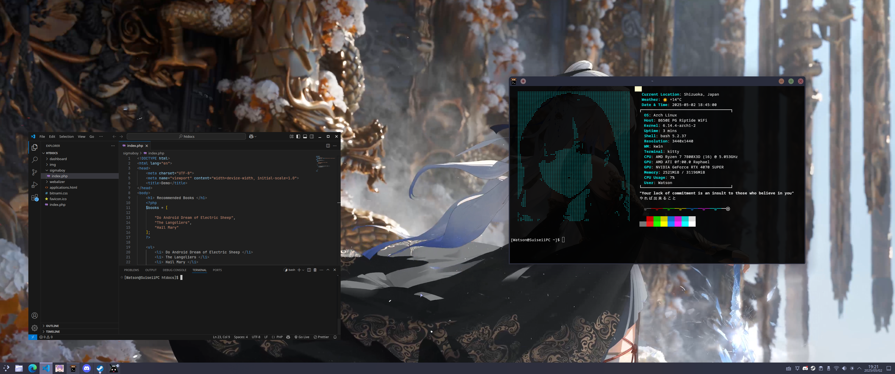

<h1 align="center">🧪 My Arch Linux Dotfiles</h1>

<p align="center">
  ⚙️ Aesthetic, minimal, and functional dotfiles for <b>Arch Linux</b> with <b>KDE Plasma</b>, <b>Kitty</b> terminal, and <b>Neofetch</b>.<br>
  🎨 Featuring the <a href="https://github.com/catppuccin/catppuccin">Catppuccin Theme</a>.
</p>

---

## 📸 Preview



---

## 📁 Structure

```bash
dotfiles/
├── kde/         # KDE Plasma configuration (themes, window rules, appearance)
├── kitty/       # Kitty terminal configuration (theme, font, behavior)
├── neofetch/    # Neofetch display config (colors, OS logo, info)
├── images/      # Desktop Images Sample
└── README.md
